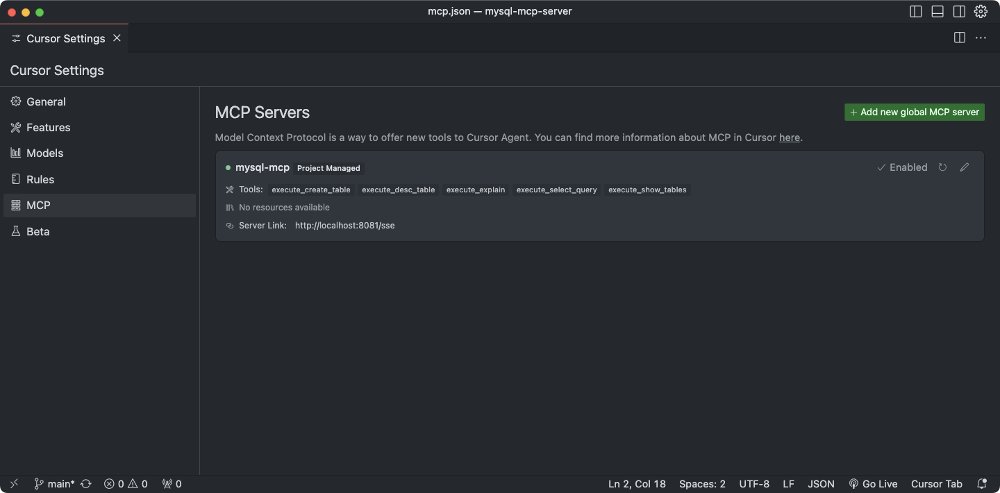

# mysql-mcp-server

<a href="https://glama.ai/mcp/servers/6y836dz8o5">
  
</a>

> --stdio execution mode is currently in the development phase.

[한국어 README.md](https://github.com/Mineru98/mysql-mcp-server/blob/main/README.ko.md)

## 0. Execution

### Running with Docker

> Change the database connection information as needed.

```
docker run -d --name mcp-mysql \
  -e MYSQL_HOST=localhost \
  -e MYSQL_PORT=3306 \
  -e MYSQL_USER=root \
  -e MYSQL_PASSWORD=mcpTest1234!!! \
  -e MYSQL_DATABASE=mcp_test \
  -e MCP_PORT=8081 \
  -p 3306:3306 mineru/mcp-mysql:1.0.0
```

### Running with Docker Compose

> This will proceed with a pre-configured setup.

```
docker-compose up -d
```

### Running directly with Python

```
pip install -r requirements.txt
python mysql_mcp_server/main.py run
```

### Cursor Configuration

> MCP functionality is available from Cursor version 0.46 and above.
>
> Additionally, the MCP feature is only accessible to Cursor Pro account users.



### Tool Addition Tips

- Adding a Tool
  - `execute` functions implement the actual logic execution (Service Layer).
  - The `@tool` decorator helps register the tool with MCP (Controller Layer).
- Explanation
  - Each file under `mysql_mcp_server/executors` represents a single tool.
  - If a new tool is added, it must be imported in `mysql_mcp_server/executors/__init__.py` and included in the `__all__` array.
  - This ensures the module is automatically registered in the `TOOLS_DEFINITION` variable.
  
```mermaid
flowchart LR;
    A[AI Model] -->|Request tool list| B[MCP Server]
    B -->|Return available tools| A

    A -->|Request specific tool execution| B
    B -->|Call the corresponding executor| C[Executors]
    
    subgraph Executors
        C1[execute_create_table] -->|Create table| D
        C2[execute_desc_table] -->|View table schema| D
        C3[execute_explain] -->|Query execution plan| D
        C4[execute_select_query] -->|Execute SELECT query| D
        C5[execute_show_tables] -->|Retrieve table list| D
    end

    D[DatabaseManager] -->|Connect to MySQL| E[MySQL 8.0]

    E -->|Return results| D
    D -->|Send results| C
    C -->|Return results| B
    B -->|Return execution results| A
```

## 1. Overview

MCP MySQL Server is a server application for MySQL database operations based on MCP (Model Context Protocol). This server provides tools that allow AI models to interact with the MySQL database.

## 2. System Configuration

### 2.1 Key Components

- **MCP Server**: A FastMCP or stdio-based server that communicates with AI models
- **MySQL Database**: Manages and stores data
- **Tools**: Executors that perform database operations

### 2.2 Tech Stack

- **Language**: Python
- **Database**: MySQL 8.0
- **Key Libraries**:
  - mcp: Implements Model Context Protocol for AI communication
  - PyMySQL: Connects to MySQL and executes queries
  - pandas: Processes and analyzes data
  - python-dotenv: Manages environment variables
  - fire: Implements command-line interfaces

### 2.3 Deployment Environment

- Containerized deployment via Docker and Docker Compose
- Ports: 8081 (MCP Server), 3306 (MySQL)

## 3. Directory Structure

```
MCPMySQLBoilerPlate/
├── mysql_mcp_server/           # Main application directory
│   ├── executors/              # Database operation executors
│   │   ├── create_table.py     # Tool for creating tables
│   │   ├── desc_table.py       # Tool for viewing table schema
│   │   ├── explain.py          # Tool for query execution plans
│   │   ├── select_query.py     # Tool for SELECT query execution
│   │   └── show_tables.py      # Tool for retrieving table lists
│   ├── handlers/               # MCP request handlers
│   │   ├── call_tool.py        # Handles tool execution
│   │   └── list_tools.py       # Provides tool list
│   ├── helper/                 # Utility modules
│   │   ├── db_conn_helper.py   # Manages database connections
│   │   ├── logger_helper.py    # Logging utilities
│   │   └── tool_decorator.py   # Tool decorator
│   ├── models/                 # Data models
│   └── main.py                 # Application entry point
├── docker-compose.yml          # Docker Compose configuration
├── Dockerfile                  # Docker image build settings
├── requirements.txt            # Dependency package list
└── .env.example                # Example environment variables file
```

## 4. Architecture Design

### 4.1 Layered Structure

1. **Interface Layer**: MCP Server (FastMCP or stdio)
2. **Business Logic Layer**: Handlers and Executors
3. **Data Access Layer**: Database connection and query execution

### 4.2 Key Classes and Modules

- **MySQLMCPServer**: Main server class that initializes and runs the MCP server
- **DatabaseManager**: Singleton pattern-based database connection manager
- **Executors**: Collection of tools for database operations
  - execute_create_table: Creates tables
  - execute_desc_table: Checks table schema
  - execute_explain: Provides query execution plans
  - execute_select_query: Executes SELECT queries
  - execute_show_tables: Retrieves table lists

### 4.3 Communication Flow

1. AI model requests a list of available tools from the MCP server.
2. The server returns the available tools list.
3. The AI model requests the execution of a specific tool.
4. The server calls the corresponding executor to perform the database operation.
5. The execution results are returned to the AI model.

## 5. Scalability and Maintenance

- **Adding Tools**: Implement new tools in the `executors` directory and register them in `__init__.py`.
- **Environment Configuration**: Manage environment variables via the `.env` file.
- **Logging**: Ensure consistent logging using `logger_helper`.

## 6. Deployment and Execution

### 6.1 Local Execution

```bash
# Setup environment
cp .env.example .env
# Modify .env file as needed

# Install dependencies
pip install -r requirements.txt

# Run the server
python mysql_mcp_server/main.py run
```

### 6.2 Docker Deployment

```bash
# Start database using Docker Compose
docker-compose up -d db
# Build and run mysql-mcp-server with Docker Compose (including rebuilds)
docker-compose up -d --build mysql-mcp-server
```

## 7. Security Considerations

- Manage database credentials via environment variables.
- Use strong passwords in production environments.
- Consider implementing SSL/TLS encryption for database connections when necessary.